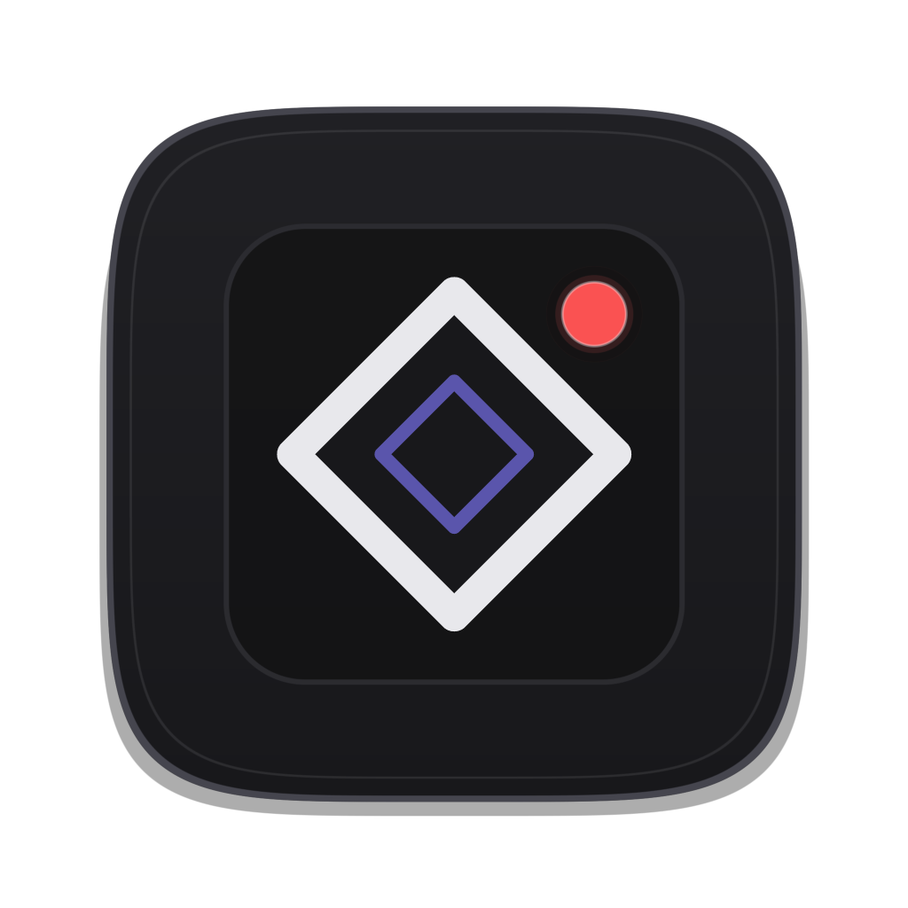
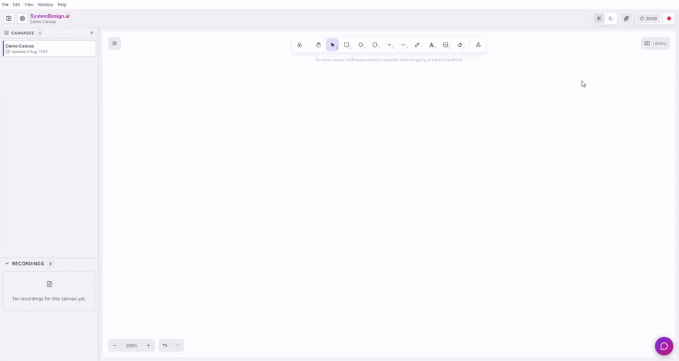
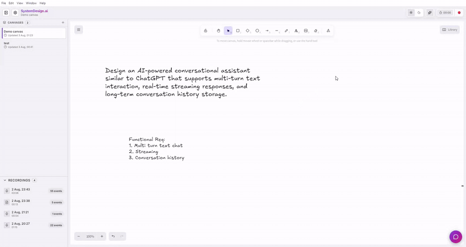
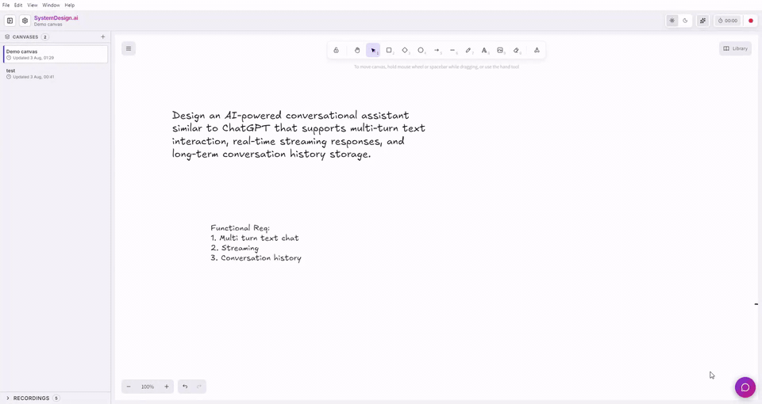
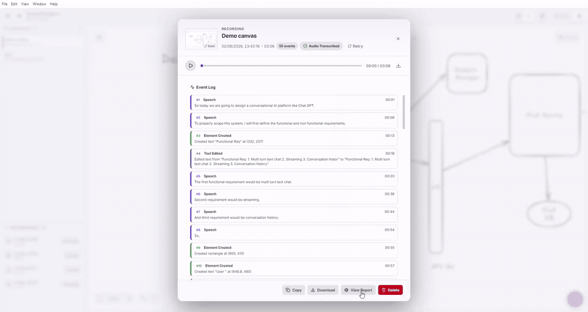
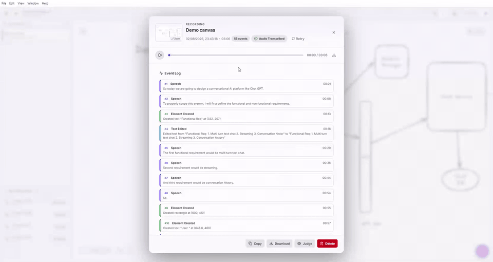

<p align="center">
  
</p>

<h1 align="center">SystemDesign.ai</h1>

<p align="center">
  <strong>AI-powered system design mock interviewer.<br/>Draw. Explain. Get scored — completely free.</strong>
</p>

<p align="center">
  
  
  
  
</p>

---

An Electron desktop app that turns [Excalidraw](https://excalidraw.com) into a full system design interview practice tool. An AI interviewer asks you realistic questions, you draw and explain your architecture on the canvas, and an AI judge scores your performance across 7 dimensions — all locally, all private.

**Use it 100% free (unlimited)** with free models on OpenRouter and Google AI Studio's. No subscriptions, no sign-ups beyond the API keys.

---

## Features

### 🎲 AI Interview Question Generator

One-click generation of realistic HLD interview questions across **14+ domains** — Messaging & Social, Media & Streaming, Commerce & Payments, Transportation, Cloud Infrastructure, AI/ML, Security, and more.

The generated question is placed directly on your Excalidraw canvas as a text element, so it's always visible while you work — just like having a prompt written on the whiteboard.

You can optionally provide context or hints to steer the question in a specific direction, or let the AI pick a domain at random.

<p align="center">
  
  <br/><sub>AI-generated interview question placed directly on the canvas</sub>
</p>

---

### ⏺️ Session Recording with Audio

Hit record and start designing. The recorder captures everything happening on the canvas in real time:

- **Every drawing action** — element creation, movement, resizing, connecting arrows, text edits
- **Your voice** — microphone audio recorded alongside your diagram changes
- **Timestamped event timeline** — a complete log of what you drew and when, with millisecond precision

Pause and resume at any time. Each session is saved locally with a compact JSON format and can be exported or copied to clipboard.

After you stop recording, your audio is **automatically transcribed** using Google Gemini. Speech is broken into natural segments with timestamps and merged into your event timeline — so you can see exactly what you said while drawing each component.

<p align="center">
  
  <br/><sub>Recording toolbar with timer, pause/resume, and stop controls</sub>
</p>

---

### 🤖 AI Interviewer Chatbot

A simulated interviewer that sits alongside your canvas in a chat panel. It behaves like a real interviewer — answers your clarifying questions with realistic numbers and constraints, but **never gives away the solution**.

> *"How many users?"* → *"Let's say around 100 million monthly active users."*
>
> *"Do we need real-time?"* → *"Yes, messages should be delivered in near real-time, under a second."*
>
> *"Should I use SQL or NoSQL?"* → *"That's a design decision for you to make. What trade-offs are you considering?"*

Supports both **text and voice input**. Use the microphone button to speak your question — it's transcribed in real time and sent to the interviewer. Voice input supports two modes: fast **Gemini Live** (WebSocket streaming for low-latency real-time transcription) and fallback **REST** transcription. The full conversation is saved as part of your recording session.

<p align="center">
  
  <br/><sub>AI interviewer chat with voice input — ask clarifying questions just like a real interview</sub>
</p>

---

### ⚖️ AI Judge & Scoring

Open any recording and run the **AI Judge** to get a detailed evaluation report. The judge analyzes your entire session — every drawing action, every word you said — and scores you across **7 dimensions**:

| Dimension | What it evaluates |
|---|---|
| **Problem Understanding** | Did you clarify requirements and constraints? |
| **High-Level Architecture** | Is the overall design sound? Major components identified? |
| **Component Design** | Are individual components well thought out? |
| **Data Model** | Is the data model appropriate for the problem? |
| **Scalability** | Did you address caching, load balancing, sharding? |
| **Communication** | Did you explain your thinking clearly and structured? |
| **Diagram Quality** | Is the diagram organized, readable, and complete? |

Each dimension gets a **1–5 score** with specific observations referencing your actual drawing and speech. The report also includes an **overall score**, top 3 strengths, and top 3 areas for improvement.

<p align="center">
  
  <br/><sub>Detailed judge report with per-dimension scores, strengths, and improvements</sub>
</p>

---

### 🎬 Recording Playback & Review

Open any past recording from the sidebar to review your performance in detail:

- **Final canvas snapshot** — a rendered preview of your completed diagram
- **Audio playback** — full audio player with seek bar synced to the event timeline
- **Event log** — scroll through every action with timestamps; active events highlight as audio plays
- **Transcription badges** — see transcription status (running, done, or failed)
- **Export** — copy session JSON to clipboard or download as a file

<p align="center">
  
  <br/><sub>Recording review with audio playback synced to the event timeline</sub>
</p>

---

### 📁 Multi-Canvas Workspace & More

- **Multiple canvases** — create, rename, and delete canvases, each with their own recordings
- **Auto-save** — your work is saved automatically as you draw, never lose progress
- **Collapsible sidebar** — toggle the canvas list and recordings panel
- **Dark & light mode** — full theme support, toggle directly from the toolbar
- **Configurable models** — swap in any model from OpenRouter or change the transcription model
- **Feature toggles** — enable/disable audio recording, judge, question gen, or chatbot independently

---

## 🚀 Quick Start

### Prerequisites

- **Node.js** 18+ and **npm**
- An **OpenRouter API key** — [setup guide](./docs/API_SETUP.md#openrouter)
- A **Google AI Studio API key** — [setup guide](./docs/API_SETUP.md#google-ai-studio-gemini)

### Install & Run

```bash
# Clone the repository
git clone https://github.com/your-username/system-design-ai.git
cd system-design-ai

# Install dependencies
npm install

# Start the app
npm run dev
```

---

## 🎯 How to Use

<table>
<tr>
<td width="60"><h3>1</h3></td>
<td>
<strong>Add your API keys</strong><br/>
Open <strong>⚙️ Settings</strong> (gear icon in the top bar) → paste your OpenRouter and Gemini keys.<br/>
<sub>→ <a href="./docs/API_SETUP.md">Step-by-step API setup guide</a> (5 min, both can be free)</sub>
</td>
</tr>
<tr>
<td><h3>2</h3></td>
<td>
<strong>Create a canvas</strong><br/>
On first launch you'll be prompted to name your canvas (e.g. "Design WhatsApp"). You can create as many as you need.
</td>
</tr>
<tr>
<td><h3>3</h3></td>
<td>
<strong>Generate an interview question</strong><br/>
Click the 🎲 button in the toolbar. Optionally pick a domain or add context. The question appears on your canvas.
</td>
</tr>
<tr>
<td><h3>4</h3></td>
<td>
<strong>Hit record & start designing</strong><br/>
Click ⏺️ to start recording. Draw your architecture, explain your thinking out loud. Use the 💬 <strong>Interviewer Chat</strong> to ask clarifying questions — type or use voice.
</td>
</tr>
<tr>
<td><h3>5</h3></td>
<td>
<strong>Stop recording</strong><br/>
Click Stop when you're done. Your session is saved automatically and audio transcription starts in the background.
</td>
</tr>
<tr>
<td><h3>6</h3></td>
<td>
<strong>Review & get scored</strong><br/>
Open your recording from the sidebar. Review the event log and audio playback. Click <strong>Judge</strong> to run the AI evaluation and get your detailed score report.
</td>
</tr>
</table>

---

## ⚙️ Configuration

All settings are accessible from the **Settings** dialog (⚙️):

### API Keys
| Key | Used For |
|---|---|
| OpenRouter API Key | Judge evaluation, question generation, interviewer chatbot |
| Gemini API Key | Audio transcription (speech → text) |

### Models
| Model Slot | Default | Purpose |
|---|---|---|
| Audio Model | `gemini-3.1-flash-live-preview` | Audio → text transcription via Google AI |
| Smart Model | `nvidia/nemotron-3-ultra-550b-a55b:free` | Judge evaluation (needs strong reasoning) |
| Fast Model | `google/gemini-3.1-flash-lite` | Question gen & chatbot (speed matters) |

> 💡 You can swap in **any model** available on OpenRouter — including free open-source models like Llama and Gemma. Browse models at [openrouter.ai/models](https://openrouter.ai/models).

### Feature Toggles
| Feature | Default |
|---|---|
| Audio Recording | ✅ On |
| Audio Transcription | ✅ On |
| Judge | ✅ On |
| Question Generation | ✅ On |
| Chatbot | ✅ On |

Toggle any feature on/off based on your needs.

---

## 🏗️ Building from Source

### Build Commands

```bash
npm run dev           # Dev server + Electron
npm run build         # TypeScript compile + Vite production build
npm run dist:mac      # macOS → release/*.dmg + .zip
npm run dist:linux    # Linux → release/*.AppImage + .tar.xz
npm run dist:win      # Windows → release/*.exe (NSIS installer + portable)
```

### Tech Stack

- **Electron** — desktop shell
- **React 18** + **TypeScript** (strict) — UI
- **Vite** — build tool
- **Excalidraw** — canvas engine
- **Radix UI** — accessible dialog & scroll components
- **Lucide** — icons
- **CVA** — component styling

### Project Structure

Organized using [Feature-Sliced Design](https://feature-sliced.design/) architecture:

```
src/
├── app/           # Providers (Settings, Toast)
├── entities/      # Domain types (canvas, chatbot, recording, settings)
├── features/      # Feature modules (canvas, chatbot, judge, questions, recorder, settings)
├── pages/         # EditorPage — main app view
├── processes/     # Business logic hooks (canvas, chatbot, recording)
├── shared/        # Components, lib (ai, audio, canvas, gemini), types, utils
├── widgets/       # Composite blocks (Sidebar, Toolbar, ChatbotPanel, ToastContainer)
├── styles.css     # All styles (single file)
└── vite-env.d.ts  # Window API type declarations
electron/
├── main.ts        # Electron main process — all file I/O via IPC handlers
└── preload.ts     # Context bridge — exposes canvasAPI, recordingAPI, settingsAPI, recorderAPI
```

---

## 🤝 Contributing

Contributions are welcome! Feel free to open issues, suggest features, or submit pull requests.

---

## 📄 License

MIT — use it, modify it, ship it.
